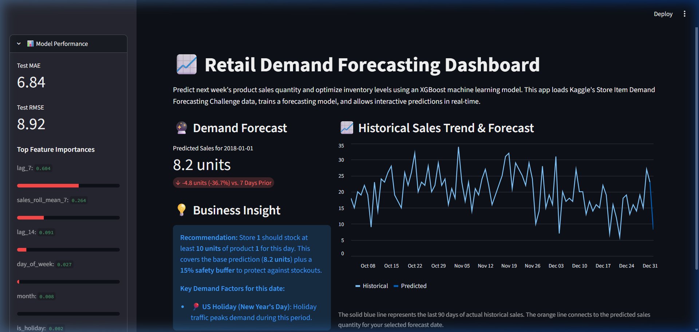

# Retail Demand Forecasting Dashboard

An interactive, single-file Streamlit application for retail inventory optimization. By forecasting next-week product sales quantities across store locations, this tool helps retail managers maintain optimal stocking levels, preventing costly stockouts during peak periods while reducing capital tied up in excess warehouse inventory.

This dashboard integrates a **real historical retail dataset** to provide realistic demand forecasts and business insights.

---

## 📷 App Preview


---

## 🛠️ Tech Stack
- **Dashboard Interface:** [Streamlit](https://streamlit.io/)
- **Machine Learning Model:** [XGBoost](https://xgboost.readthedocs.io/)
- **Data Manipulation:** [Pandas](https://pandas.pydata.org/) & [NumPy](https://numpy.org/)
- **Preprocessing & Metrics:** [Scikit-learn](https://scikit-learn.org/)

---

## 🏗️ Data Source & Performance Design
- **Real Dataset:** Kaggle's *Store Item Demand Forecasting Challenge* dataset (`store_sales.csv`) featuring daily sales records for 10 stores and 50 products across 5 years (~913,000 transactions).
- **Outlier Capping & Quality Assurance:** Capping sales at the 99th percentile per product to prevent extreme outliers from distorting forecasts, with automatic group-based missing value imputation.
- **Advanced Caching:** Leveraging Streamlit's `@st.cache_data` (for dataset loading and preparation) and `@st.cache_resource` (for the trained model and label encoders), these expensive processes run exactly once. Subsequent user interactions with sliders and dropdown inputs respond instantly in milliseconds.

---

## 🔍 How It Works
Rather than using simple moving averages, this dashboard acts as an intelligent sales assistant:
1. **Real Sales History:** We train a forecasting model on Kaggle's historical store demand dataset, containing organic seasonality, weekly peaks, and multi-year retail growth.
2. **Holiday Mapping:** Real dates are mapped to major US holidays (New Year's, Memorial Day, July 4th, Labor Day, Thanksgiving, Black Friday, and Christmas) to capture holiday demand spikes.
3. **Simulated Promotions:** Since the dataset does not include promotional flags, a simulated `promotion_flag` column is added (10% of rows randomly selected, weighted slightly higher in November/December for the holiday season).
4. **Feature Engineering:** The system looks back at how the product performed exactly 7 and 14 days ago (lag features) and computes a rolling 7-day average of historical sales to capture recent sales momentum.
5. **Machine Learning Model:** We train an **XGBoost Regressor** (an industry-standard gradient-boosted decision tree model) which is highly effective at capturing complex interactions like *"How does an active promotion affect sales on a weekend during a major holiday?"*
6. **Time-Based Evaluation:** Rather than shuffling data randomly (which leaks future information into the past), the model is evaluated on a strict **time-based split** (the final 8 weeks of the 5-year timeline), ensuring realistic simulation of real-world forecasting accuracy.
7. **Business Recommendation:** The model translates numbers into action by predicting a base sales figure and automatically recommending a minimum inventory stocking level including a **15% safety buffer** to protect against unexpected sales surges.

   python -m streamlit run app.py
   ```
